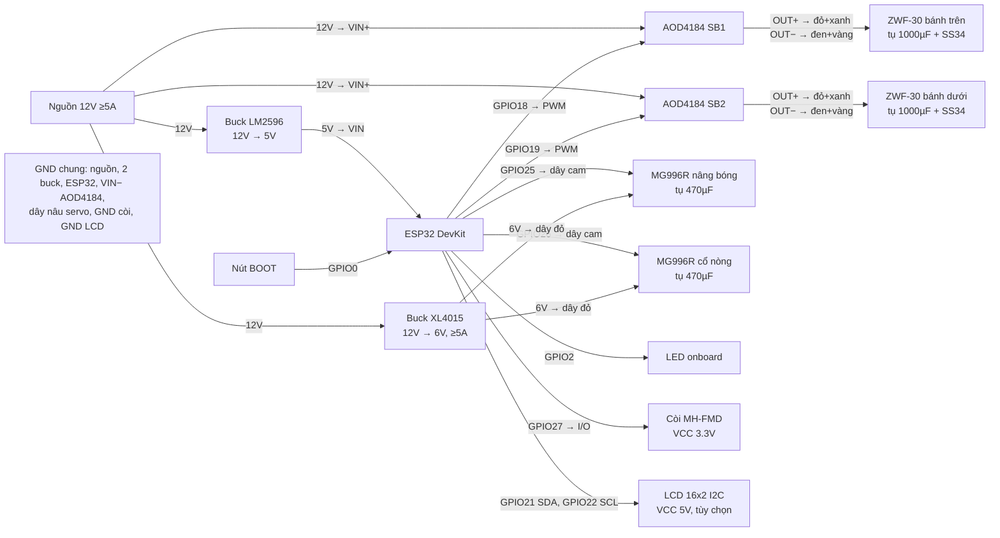
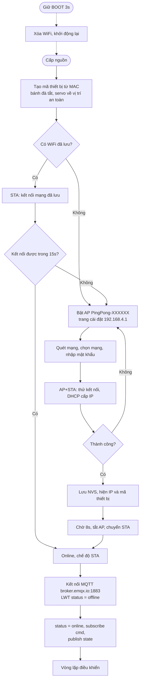
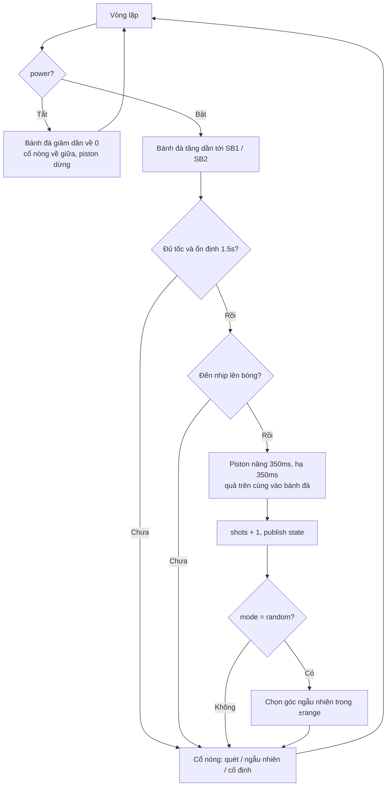

# Sơ đồ máy bắn bóng bàn

## 1. Đấu nối chân

```mermaid
flowchart LR
  PSU["Nguồn 12V ≥5A"]
  B6["Buck XL4015<br/>12V → 6V, ≥5A"]
  B5["Buck LM2596<br/>12V → 5V"]
  ESP["ESP32 DevKit"]
  A1["AOD4184 SB1"]
  A2["AOD4184 SB2"]
  M1["ZWF-30 bánh trên<br/>tụ 1000µF + SS34"]
  M2["ZWF-30 bánh dưới<br/>tụ 1000µF + SS34"]
  S1["MG996R nâng bóng<br/>tụ 470µF"]
  S2["MG996R cổ nòng<br/>tụ 470µF"]
  BTN["Nút BOOT"]
  LED["LED onboard"]
  BZ["Còi MH-FMD<br/>VCC 3.3V"]
  LCD["LCD 16x2 I2C<br/>VCC 5V, tùy chọn"]
  GND["GND chung: nguồn, 2 buck, ESP32, VIN− AOD4184,<br/>dây nâu servo, GND còi, GND LCD"]

  PSU -->|"12V"| B6
  PSU -->|"12V"| B5
  PSU -->|"12V → VIN+"| A1
  PSU -->|"12V → VIN+"| A2
  B5 -->|"5V → VIN"| ESP
  ESP -->|"GPIO18 → PWM"| A1
  ESP -->|"GPIO19 → PWM"| A2
  A1 -->|"OUT+ → đỏ+xanh<br/>OUT− → đen+vàng"| M1
  A2 -->|"OUT+ → đỏ+xanh<br/>OUT− → đen+vàng"| M2
  ESP -->|"GPIO25 → dây cam"| S1
  ESP -->|"GPIO26 → dây cam"| S2
  B6 -->|"6V → dây đỏ"| S1
  B6 -->|"6V → dây đỏ"| S2
  BTN -->|"GPIO0"| ESP
  ESP -->|"GPIO2"| LED
  ESP -->|"GPIO27 → I/O"| BZ
  ESP -->|"GPIO21 SDA, GPIO22 SCL"| LCD
```

## 2. Khởi động và WiFi

```mermaid
flowchart TD
  A([Cấp nguồn]) --> B["Tạo mã thiết bị từ MAC<br/>bánh đà tắt, servo về vị trí an toàn"]
  B --> C{"Có WiFi đã lưu?"}
  C -- Không --> P["Bật AP PingPong-XXXXXX<br/>trang cài đặt 192.168.4.1"]
  C -- Có --> D["STA: kết nối mạng đã lưu"]
  D --> E{"Kết nối được trong 15s?"}
  E -- Có --> ON["Online, chế độ STA"]
  E -- Không --> P
  P --> Q["Quét mạng, chọn mạng, nhập mật khẩu"]
  Q --> R["AP+STA: thử kết nối, DHCP cấp IP"]
  R --> S{"Thành công?"}
  S -- Không --> P
  S -- Có --> T["Lưu NVS, hiện IP và mã thiết bị"]
  T --> U["Chờ 8s, tắt AP, chuyển STA"]
  U --> ON
  ON --> M["Kết nối MQTT broker.emqx.io:1883<br/>LWT status = offline"]
  M --> N["status = online, subscribe cmd,<br/>publish state"]
  N --> L["Vòng lặp điều khiển"]
  BTN(["Giữ BOOT 3s"]) -.-> X["Xóa WiFi, khởi động lại"]
  X -.-> A
```

## 3. Vòng lặp bắn

```mermaid
flowchart TD
  L["Vòng lặp"] --> PWR{"power?"}
  PWR -- Tắt --> OFF["Bánh đà giảm dần về 0<br/>cổ nòng về giữa, piston dừng"]
  OFF --> L
  PWR -- Bật --> RAMP["Bánh đà tăng dần tới SB1 / SB2"]
  RAMP --> RDY{"Đủ tốc và ổn định 1.5s?"}
  RDY -- Chưa --> AIM
  RDY -- Rồi --> FEED{"Đến nhịp lên bóng?"}
  FEED -- Chưa --> AIM
  FEED -- Rồi --> SHOT["Piston nâng 350ms, hạ 350ms<br/>quả trên cùng vào bánh đà"]
  SHOT --> CNT["shots + 1, publish state"]
  CNT --> RND{"mode = random?"}
  RND -- Có --> NEWT["Chọn góc ngẫu nhiên trong ±range"]
  RND -- Không --> AIM
  NEWT --> AIM["Cổ nòng: quét / ngẫu nhiên / cố định"]
  AIM --> L
```

## 4. Đồng bộ MQTT hai chiều

```mermaid
sequenceDiagram
  participant W as Web React
  participant B as Broker EMQX
  participant E as ESP32
  E->>B: CONNECT, LWT ppl/id/status = offline
  E->>B: ppl/id/status = online (retain)
  E->>B: SUBSCRIBE ppl/id/cmd
  E->>B: ppl/id/state {rev, boot, ...} (retain)
  W->>B: SUBSCRIBE ppl/id/state, ppl/id/status
  B-->>W: state + status (retained)
  Note over W: Kéo slider: gửi tối đa 150ms/lần,<br/>không gửi lại giá trị vừa gửi
  W->>B: cmd {"id":"a1","sb1":75} QoS 1
  B->>E: cmd a1
  E->>E: Áp dụng, rev + 1
  B-->>E: cmd a1 (giao lại)
  Note over E: id a1 đã xử lý, bỏ qua
  E->>B: state {rev: 8, sb1: 75} (retain)
  B-->>W: state rev 8
  Note over W: Bỏ state có rev cũ hơn<br/>trong cùng boot
```
